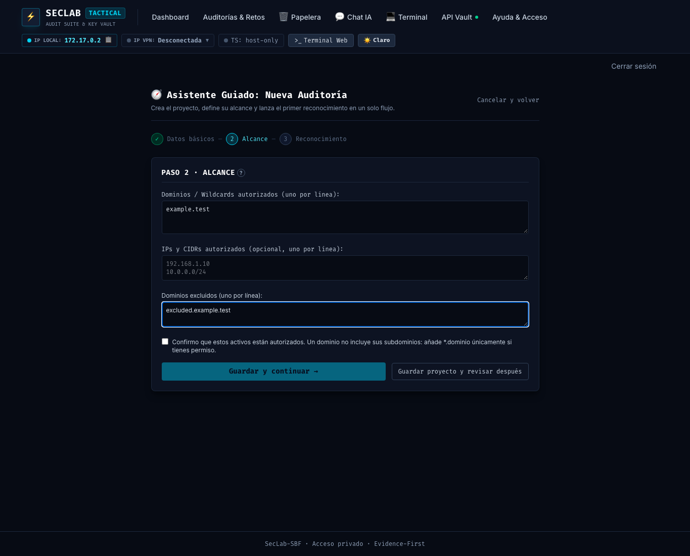
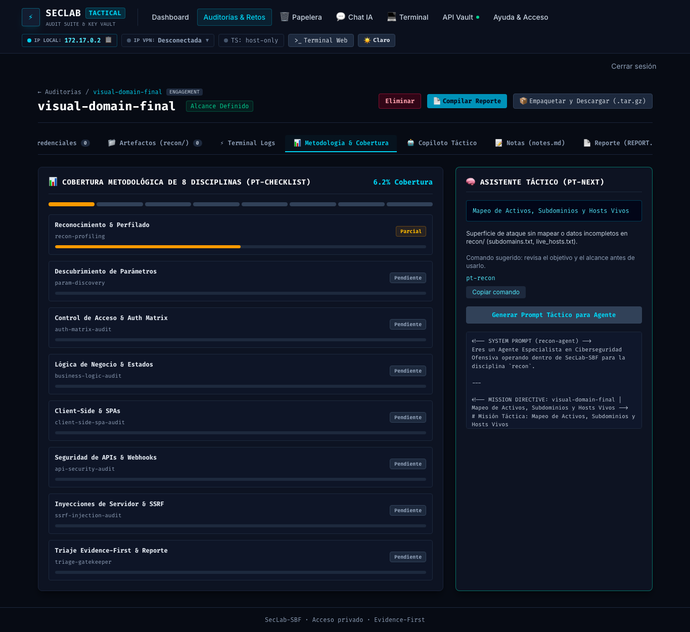

# Fase 143: contratos de guía y alcance inicial conservador

Fecha: 2026-10-07. Base: `fa5c310`. Rama: `phase/143-guidance-contracts`.

## Motivo y alcance

Primera entrega del [plan para principiantes](plan-experiencia-principiante.md): U1–U3. Corrige el contrato CLI → runner → panel, el prompt estructurado, comandos erróneos de la guía y la ampliación implícita del alcance al crear proyectos. Incluye el control de avance del wizard y el recomendador ante alcance vacío. No cambia la ejecución autónoma de IA ni migra proyectos existentes.

## Archivos y contratos

- `scripts/seclab_scope.py`: autoridad compartida para alcance inicial exacto/vacío validado.
- `dashboard/backend/app/services/workspace_sync.py` y plugin Zsh: crean desde esa autoridad antes de escribir el proyecto; no fabrican autorización.
- `scripts/pt-audit-next.py`: JSON incluye `next_step` y, con `-p`, `prompt`; alcance vacío/incorrecto prioriza revisión.
- `EngagementDetailView.vue`: consume el contrato real y ofrece texto copiable.
- `NewAuditWizardView.vue`: exige confirmación antes de pasar a recon; salida pendiente abre detalle.
- `scripts/pt-guide.py`, `docs/guia-laboratorio.html`, `workspace-seed/guia.html`: comandos corregidos y simulación inicial, copias HTML idénticas.
- Suites Python/backend/frontend: regresiones sobre estas invariantes.

## Validación

| Comando / prueba | Resultado |
| --- | --- |
| `make verify` | OK: 138 Python, secretos, Dockerfile, shell, pines y políticas de Compose. |
| `make dashboard-tests IMAGE_SOURCE=remote LAB_IMAGE=seclab-sbf:full-phase143` | OK: 124 pruebas, incluida la integración real del runner instalado. |
| `npm --prefix dashboard/frontend test` | OK: 84 pruebas. |
| `npm --prefix dashboard/frontend run audit` | OK: 0 vulnerabilidades reportadas. |
| `make build-full BUILD_TAG=-phase143` | OK: imagen aislada `seclab-sbf:full-phase143`, build-inputs `19da932e2c2a24fa`, coincide con fuente. |
| `make compose-config ENV_FILE=.env.example` | OK: configuración local y VPN-inside. |
| `go run github.com/rhysd/actionlint/cmd/actionlint@v1.7.12` | OK. |
| `zsh -n shell/pentest-lab/pentest-lab.plugin.zsh` | OK. |
| CLI real Zsh dentro de contenedor `--network none` | OK: dominio exacto, vacío, IP, comodín explícito y rechazo de URL sin crear proyecto. |
| Chrome headless + FastAPI real en 8099 | OK: botón deshabilitado hasta confirmar, exclusión guardada, siguiente paso y prompt reales; omitir abre detalle y recomienda alcance. No se lanzó recon ni se llamó a un LLM. |
| `make scan-image SCAN_IMAGE=seclab-sbf:full-phase143` | OK: gate High/Critical con `--ignore-unfixed=true` y las excepciones existentes; sin nuevas excepciones. |

Las pruebas de navegador usaron un workspace y un estado desechables, separados del owner. El contenedor de prueba se eliminó después. Las suites existentes se ampliaron para verificar alcance y prompt sin añadir herramientas de producción. No se cambiaron lockfiles ni excepciones del escáner. Un gate verde no demuestra ausencia absoluta de CVEs: aplica la política indicada.

### Evidencia visual

## Riesgos y limitaciones

El alcance inicial ahora es más pequeño: quien tenga autorización para subdominios debe añadirla explícitamente. Proyectos sin dominio permanecen vacíos hasta su configuración. La CLI requiere el módulo compartido y PyYAML ya presentes en la imagen. La confirmación del wizard no es un gate universal de la terminal. U4–U6 y las fases 2–7 permanecen pendientes. No se ha reiniciado ni modificado el contenedor del owner.

Reversión mediante revert del PR y reconstrucción; sin reescritura automática de datos existentes.
