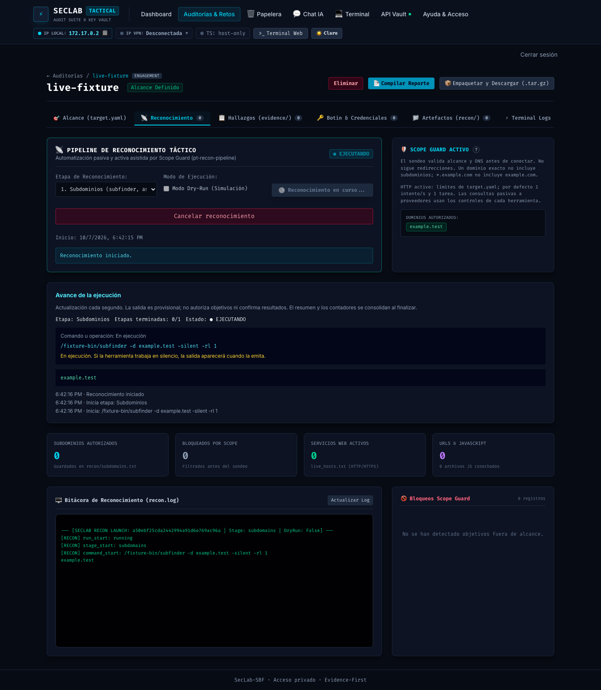
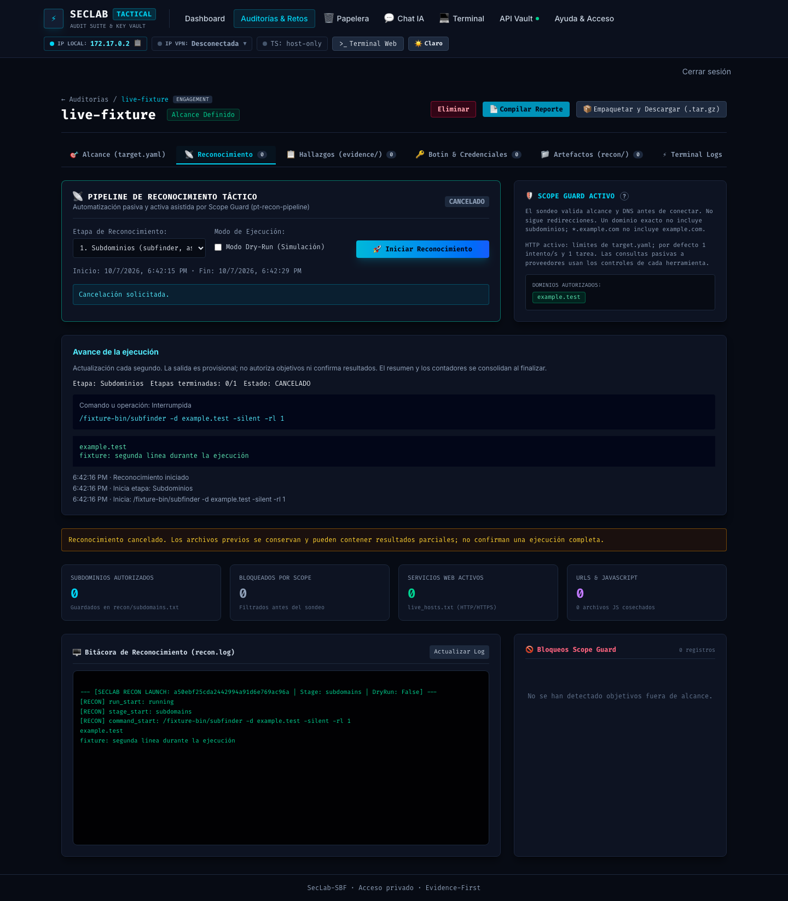

# Fase 145: avance del reconocimiento durante la ejecución

Fecha: 2026-10-07. Base: `a1e2a17`. Rama: `phase/145-live-recon-progress`. PR: [#165](https://github.com/hackadvisermx/seclab-sbf/pull/165), abierto para revisión del owner; merge pendiente.

## Problema y resultado

El pipeline esperaba la terminación de cada herramienta con `subprocess.run(capture_output=True)`. Aunque el dashboard consultaba periódicamente la bitácora, la salida de la herramienta quedaba retenida hasta el final. El operador no podía distinguir qué comando estaba trabajando ni ver sus mensajes durante una ejecución larga.

La pestaña Reconocimiento incorpora **Avance de la ejecución**: etapa actual, número de etapas terminadas, estado del job, comando exacto con sus argumentos, últimos mensajes de stdout/stderr y eventos de inicio/fin. Se consulta cada segundo. El sondeo HTTP propio se presenta como operación interna GET por HTTP/HTTPS y publica observaciones al terminar cada host, sin inventar un comando externo.

## Contrato y alcance

- Fuente: el pipeline emite eventos antes y después de las etapas y comandos; los subprocesos se leen mientras están vivos. Dos archivos temporales anónimos separados evitan bloquear stdout/stderr y preservan la salida completa para el procesamiento final. Los lectores tienen descriptores independientes. La captura comprueba timeout y recoge el hijo; este permanece en el grupo del pipeline para conservar la cancelación existente.
- Persistencia: reemplazo atómico de `recon/progress.json`, con `run_id`, etapa, comando/estado, etapas terminadas, hora, cola de salida y eventos. La cola conserva 80 líneas de hasta 2000 caracteres y 32 eventos; no es un historial completo. El log sigue recibiendo los mensajes incrementales.
- Consumidor: el servicio inyecta `SECLAB_RECON_RUN_ID` en el pipeline. La respuesta del endpoint existente de estado incluye `progress` únicamente cuando corresponde al job actual; archivo ausente, inválido o de otra ejecución devuelve `null`. Se conserva la autenticación existente.
- Vista: polling de un segundo sin solapamiento. El estado persistido del job prevalece si se cancela o interrumpe y el último snapshot todavía señala un comando activo. Se evita mostrar el error de un resumen anterior durante un nuevo job.
- Side effects: no se ejecutan comandos adicionales ni se alteran alcance, límites, DNS, redirecciones o sugerencias IA. El callback de sondeo publica por orden de finalización y mantiene el orden original de los resultados persistidos.
- Resultado: comandos y salida visibles antes del fin; métricas y artefactos siguen consolidándose en sus puntos existentes. Una salida distinta de cero o timeout conserva fallo cerrado: la salida provisional no se convierte en resultados aceptados y se conservan archivos anteriores.
- Compatibilidad: `--json` mantiene una sola respuesta final JSON y no activa streaming; `--dry-run` no escribe progreso. La CLI normal también muestra eventos/salida; la correlación del dashboard se aplica a los jobs que él inicia.

## Validación

| Comprobación | Resultado |
| --- | --- |
| `make verify` | OK: 143 pruebas Python y gates de secretos, Dockerfile, shell, pines y Compose. |
| `make dashboard-tests IMAGE_SOURCE=remote LAB_IMAGE=seclab-sbf:full-phase145` | OK: 125 pruebas del backend. |
| `npm --prefix dashboard/frontend test` | OK: 85 pruebas. |
| `npm --prefix dashboard/frontend run audit` | OK: 0 vulnerabilidades. |
| `make build-full BUILD_TAG=-phase145` | OK: imagen aislada, build-inputs `c8dd7c84d59322e9`. |
| `make compose-config ENV_FILE=.env.example` | OK: configuración local y VPN-inside. |
| `go run github.com/rhysd/actionlint/cmd/actionlint@v1.7.12` | OK. |
| `make scan-image SCAN_IMAGE=seclab-sbf:full-phase145` | OK: gate High/Critical aprobado para la imagen final, sin nuevas excepciones. |

Las regresiones ejecutan una herramienta lenta real y comprueban que su salida se publica mientras vive, que el fallo no reemplaza artefactos y que el timeout mata/recoge al hijo. También comprueban cola acotada, sondeo rápido antes del lento sin reordenar artefactos, correlación por ejecución, JSON corrupto y presentación de una cancelación.

Chrome/Playwright usó un backend real como tester en un contenedor desechable, puerto 8099 y workspace separado. Un enumerador de fixture emitió stdout, esperó, emitió stderr y continuó vivo; la interfaz y API mostraron ambas líneas y el comando antes del fin. Cancelar dejó el job CANCELADO y la operación Interrumpida. No se hicieron consultas contra objetivos reales ni se montaron datos del owner. El contenedor de prueba fue eliminado.

## Uso y límites

Abrir un proyecto → Reconocimiento → elegir etapa → Iniciar reconocimiento. El nuevo panel muestra lo que se está ejecutando; la bitácora completa permanece debajo. Si una herramienta no emite salida o la retiene internamente, se ve el comando activo y se espera su emisión. No se prometen porcentajes ni exhaustividad: el contador mide etapas terminadas.

Los candidatos de la salida pueden estar fuera de alcance; son información provisional, no autorización. Las validaciones y filtrado existentes siguen aplicándose al aceptar resultados. El progreso conserva solo el último comando y eventos recientes, no una auditoría histórica ni seguimiento de ejecuciones CLI concurrentes sobre el mismo proyecto.

Para usarlo en el contenedor del owner, después del merge se requiere reconstruir y relanzar en el momento elegido por él (`make build-full`, `make compose-down`, `make compose-up`). No se reemplazó su etiqueta de imagen ni se reinició el contenedor en uso.

Esta mejora explícita de observabilidad es adicional al plan de experiencia para principiantes; no marca como completas sus fases 2–7. No añade dependencias, migraciones ni excepciones de CVE. El escaneo conserva la política existente `--ignore-unfixed=true`.

Reversión: revert del PR y reconstrucción. No requiere modificar proyectos existentes; un `progress.json` residual se ignora por correlación.
