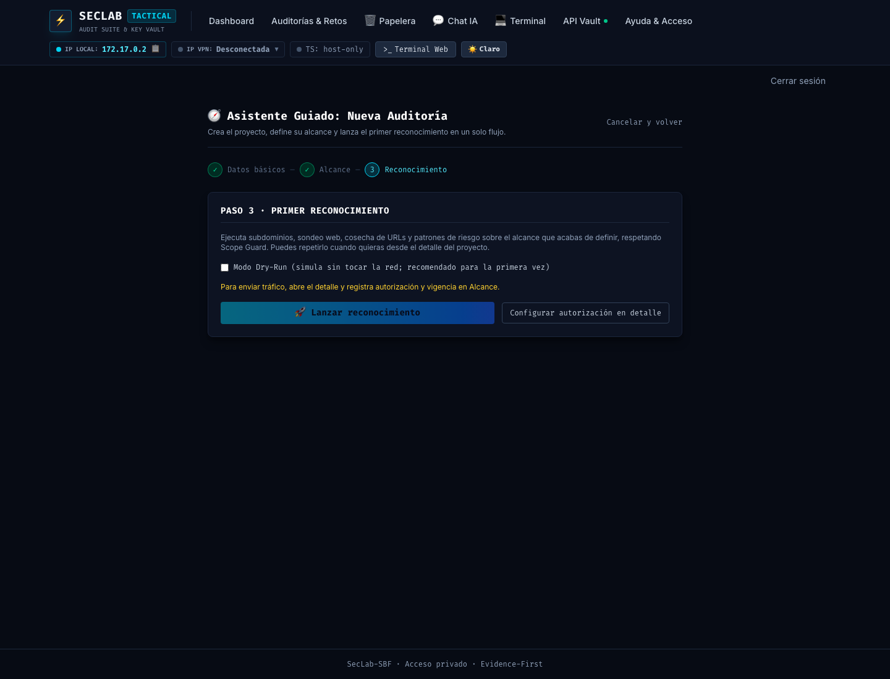
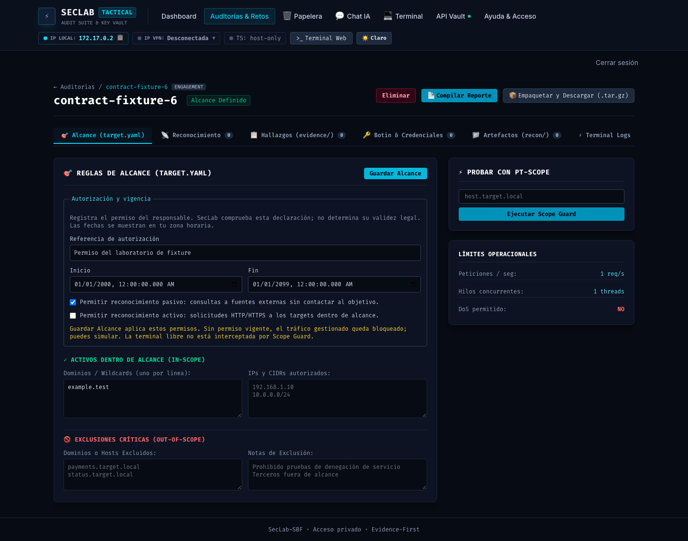
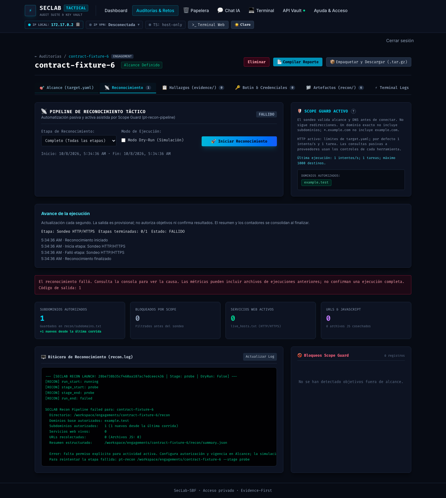

# Fase 150: autorización operativa explícita

Fecha: 2026-10-08. Base: `7bdfc60` (PR #169, fase 149). Rama: `phase/150-authorization-contract`. Worktree: `/Users/castr/tmp/t01-authorization-contract`. Entrega V3-01b.

## Cambios

`target.yaml` incorpora `authorization`: referencia declarada, inicio/fin con zona horaria y permisos independientes `allow_passive`/`allow_active`. Los proyectos nuevos de API y Zsh comienzan sin permisos, fechas ni referencia. La creación CLI también elimina permisos que pudiera contener una plantilla previa. No se infiere autorización de las reglas de scope ni de assets descubiertos.

El schema requiere booleanos reales y, para habilitar actividad, referencia e inicio/fin válidos. Inicio inclusivo y fin exclusivo; se comparan instantes, incluidos offsets equivalentes. El matcher de alcance conserva su contrato: estar IN_SCOPE no significa disponer de permiso operativo. `pt-scope show` distingue la declaración de autorización del resultado del matcher.

Antes de consultas a fuentes externas se verifica permiso pasivo/vigencia; antes de DNS y de cada nueva conexión HTTP/HTTPS, después de esperar el rate limit, se verifica permiso activo/vigencia. El contrato y su revisión incluyen la autorización, de modo que revocar permisos o cambiar la ventana impide continuar un plan o checkpoint previo. El sondeo directo también comprueba permiso activo. Simulación y pasos locales no necesitan estos permisos; siguen requiriendo alcance técnicamente válido.

El editor de Alcance registra referencia, fechas en zona local y ambos permisos. Guardar envía UTC; conserva alcance y el permiso que no se seleccionó. Guardar permanece bloqueado hasta cargar el contrato y ante errores de carga; hay reintento explícito. El wizard permite simular y dirige al detalle para configurar autorización antes de emitir tráfico. `pt-next` propone revisar autorización/vigencia cuando falta un permiso para el recorrido completo.

## Validación

- `make verify`: **167 Python**, incluidos 7 casos nuevos de autorización. Cobertura de defaults, independencia, schema, zona horaria, límites de ventana, parser sin PyYAML, bloqueo anterior a proceso/DNS y expiración durante rate limit.
- Backend en imagen aislada y sin red: **130 pruebas**. Payload inválido, incluidas actualizaciones parciales de autorización, no sobrescribe `target.yaml`.
- Frontend: **91 pruebas**, audit **0 vulnerabilidades** y build Vite aprobado. DOM real de Vue conserva permiso pasivo sin habilitar activo; prueba de carga pendiente/error/reintento impide guardar un contrato incompleto.
- Comparación con baseline `7bdfc60`, usando fixtures `.test` y mocks sin red: antes `active_dns_blocked=false`/`passive_tool_blocked=false`; después ambos `true`. No se lanzan herramientas ni consultas reales en esta comparación.
- Las 7 pruebas de autorización pasan contra los helpers instalados en `full-phase150`, rootfs de solo lectura, `--network none`, usuario tester. Zsh real crea un proyecto de fixture con dominio exacto y permisos desactivados.
- Build aislado `seclab-sbf:full-phase150`: hash **`4d89809afbb564fd`**, igual a los insumos. Smoke, Compose con `.env.example`, Actionlint y gate High/Critical aprobados bajo política existente, sin nuevas excepciones.
- Chrome real + backend/pipeline desechables en `127.0.0.1:8099`: wizard evita lanzamiento no simulado; permisos iniciales desactivados; guardar/reabrir conserva permiso pasivo y fechas UTC desde Mexico City; enumerador de fixture completa; probe sin permiso activo falla; dry-run de probe completa. No se consulta el target: el enumerador es un script de fixture y el sondeo queda bloqueado antes de DNS.
- [Medición 150](baselines/v3-phase150.json) conserva las comprobaciones técnicas de simulación, reanudación y reporte; no mide usabilidad humana.

### Evidencia visual

## Uso y compatibilidad

Los proyectos existentes sin `authorization` conservan sus datos, pero los siguientes jobs de tráfico gestionado quedan bloqueados hasta registrar el permiso y la ventana. No se migra ni habilita nada automáticamente. Los checkpoints anteriores al nuevo contrato requieren simular y ejecutar sin `--resume`; se conservan los artefactos existentes. Una autorización vencida no impide revisar evidencia o generar un reporte histórico.

Desde el dashboard: Alcance → referencia/fechas → seleccionar solo actividades permitidas → Guardar Alcance → simular → ejecutar la etapa permitida. En YAML las fechas deben ser strings ISO 8601 entre comillas, con `Z` u offset explícito. Permisos usan `true`/`false` sin comillas. `allow_passive` autoriza consultas a fuentes externas; `allow_active` autoriza el sondeo interno, no todos los comandos posibles de una terminal.

## Límites y riesgos

SecLab registra una declaración del operador, no determina validez legal. La hora depende del reloj de la instancia. La revalidación no cancela procesos/solicitudes ya iniciados ni elimina la carrera entre comprobación y despacho. La terminal libre y helpers fuera del pipeline no están interceptados, indicado en la UI. No se atribuye garantía de red global.

El historial ampliado, preview navegable por decisión/target, estados separados de bloqueo/fallo y procedencia finding/job siguen pendientes en V3-01/02/03. `pt-next` orienta al recorrido completo y puede pedir un permiso que una etapa manual concreta no necesita; el runner decide por etapa. No se incorporan acciones de IA.

No se modifica el proyecto, imagen viva ni contenedor del owner. Solo se inicia y elimina infraestructura de fixture. Reversión: revertir el PR; sin migración de datos. Merges autorizados excepcionalmente durante esta sesión, sujetos a gates/CI; después vuelve aprobación individual.
