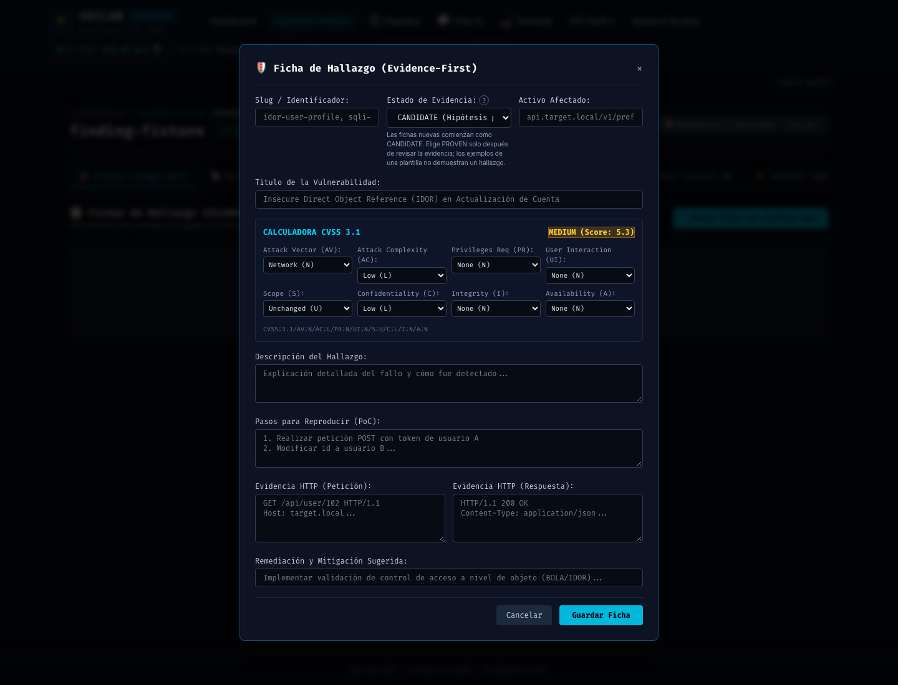
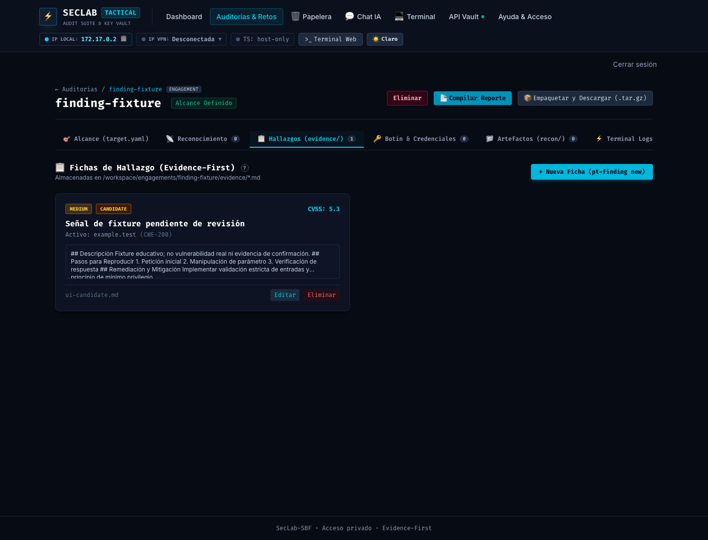

# Fase 151: las fichas empiezan sin confirmar

Fecha: 2026-10-08. Base: `dfee49f` (PR #170, fase 150). Rama: `phase/151-candidate-by-default`. Worktree: `/Users/castr/tmp/t01-finding-candidate`. Entrega V3-03c.

## Brecha comprobada

UI, API, CLI y las cuatro plantillas iniciaban una ficha como `PROVEN`. La lectura de una ficha sin status también asumía confirmación en API/compilador. Esto podía elevar un ejemplo de plantilla o un registro incompleto a riesgo confirmado por omisión.

Además, `pt-finding new --status proven` asignaba `status_arg` sin declararlo local; una llamada posterior sin `--status` heredaba ese valor dentro de la misma shell. Se corrige la variable local para que cada nueva ficha necesite su propia decisión.

## Cambios

- Nuevo formulario, `FindingCreate` y CLI comienzan como **CANDIDATE**. Las plantillas genérica, IDOR, XSS reflejado y rate limit usan ese mismo estado. CLI imprime el estado y su ejemplo de alta usa candidate.
- Fichas legadas sin estado, con valor vacío o null se interpretan como CANDIDATE en lista/detalle/reporte, sin reescribir archivos originales.
- Se conserva un estado explícito como PROVEN, DISPROVED o MITIGATED. Una edición parcial sin status preserva el estado existente, según el contrato de la fase 139. Alias confirmados explícitos del compilador siguen funcionando.
- El reemplazo de estado de CLI soporta tanto plantillas nuevas CANDIDATE como placeholders PROVEN/Confirmado de workspaces anteriores. No se depende de volver a sembrar el workspace.
- El formulario aclara que una plantilla no demuestra un hallazgo y que elegir PROVEN requiere revisar evidencia. Cancelar una selección PROVEN no afecta la ficha siguiente.

## Validación

- **168 Python**: las cuatro plantillas parsean como CANDIDATE; estados ausentes/vacíos/null no incrementan confirmados del reporte; PROVEN/VERIFIED/Confirmado explícitos conservan su comportamiento.
- **132 backend**: nueva ficha omitida/null/vacía, lectura legada sin reescritura, confirmación explícita y edición parcial con estado original conservado.
- **92 frontend**, audit **0 vulnerabilidades** y Vite aprobado: DOM real confirma default y apertura siguiente tras cancelar PROVEN.
- Nuevo `scripts/verify/check-finding-defaults.sh`, integrado en smoke: Zsh real, tester, rootfs read-only y network none. Ocho fichas cubren genérica/tres especializadas, explícita, siguiente sin flag, plantilla antigua y fallback sin plantilla; default CANDIDATE y explícita PROVEN. Falla contra imagen phase150 (observa PROVEN implícito) y pasa contra phase151.
- Chrome real contra frontend/backend instalados en imagen aislada: alta, guardado y reapertura conservan CANDIDATE; una selección PROVEN cancelada no se hereda; POST API sin status crea CANDIDATE. Sin herramientas, consultas ni tráfico contra targets.
- Build aislado `seclab-sbf:full-phase151`, hash `b3f8ef0c332c3cb2`, igual a los insumos; smoke, Compose `.env.example`, Actionlint y CVE High/Critical según política existente, sin excepciones nuevas.
- [Medición 151](baselines/v3-phase151.json) mantiene los resultados técnicos previos; su finding PROVEN es explícito y sintético. No mide usabilidad humana ni acredita suficiencia de evidencia.

### Evidencia visual

## Compatibilidad y límites

Los archivos sin status pueden dejar de contar como confirmados al generar el siguiente reporte: faltaba una decisión explícita. No se modifica su contenido ni se revierten estados expresamente declarados. Los candidatos siguen visibles en matriz/detalle para trazabilidad, etiquetados y excluidos del riesgo activo. El export conserva el gate de scope/estructura.

Esta entrega no certifica automáticamente evidencia ni implementa todavía las referencias a artefactos/job, rationale de verificación o revisión humana estructurada. Un usuario aún puede declarar PROVEN explícitamente; completar sus requisitos es trabajo pendiente de V3-03. La presencia de un título/PoC de ejemplo no demuestra la vulnerabilidad. No se afirma que V3-03 esté completo.

No se modifica ningún proyecto/imagen/contenedor vivo del owner. Reversión: revertir el PR; no hay migración masiva. Excepción de merges vigente solo esta sesión, con gates y CI aprobados.
