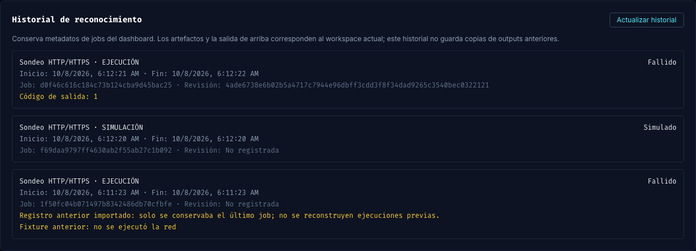

# Fase 152: historial persistente de reconocimiento

Fecha: 2026-10-08. Base: `60ad4a0` (PR #171, fase 151). Rama: `phase/152-recon-job-history`. Worktree: `/Users/castr/tmp/t01-recon-history`. Entrega V3-02a.

## Estado de cierre de sesión

Trabajo guardado por petición del owner de detenerse. Validación local completa; pendiente CI y revisión del PR. No mergeado. No iniciar otra fase al retomar sin revisar este punto de relevo. La excepción de merges correspondía a esta sesión; después vuelve la aprobación individual.

## Cambios

- SQLite conserva cada job nuevo del dashboard en una tabla aditiva, manteniendo intacta la consulta del job actual. Inicio, finalización, cancelación e interrupción actualizan ambos registros de forma transaccional y por clave de proyecto/run_id.
- Historial separado entre engagements y retos; páginas por cursor estable y límite de 1–100. API protegida por autenticación y resolución segura del proyecto. Un cursor de otro proyecto no permite leer sus jobs.
- Migración importa únicamente el último job conocido de la tabla anterior, con origen explícito y revisión desconocida. No inventa ejecuciones anteriores. Reapertura reconcilia cambios del último job realizados por una versión antigua.
- Se conserva revisión de scope solo desde un summary válido del mismo run_id, acotado y sin symlink. Una simulación sin summary nuevo no hereda la revisión del job anterior.
- UI muestra etapa, ejecución/simulación, estado, fechas, ID, revisión y error, con actualización y carga de páginas anteriores. Deduplica filas, descarta respuestas tardías de otro proyecto y vuelve a refrescar al cambiar el job actual.
- Eliminar el proyecto elimina su historial; restauración conserva el comportamiento existente. El archivo SQLite mantiene permisos privados. No se añaden outputs, comandos ni credenciales a las nuevas columnas.

## Validación local

- **168 Python**, **145 backend**, **96 frontend**; audit **0 vulnerabilidades**, Vite aprobado.
- Backend cubre migración/reapertura, downgrade y reconciliación, cancelación/recuperación, concurrencia, claves de distintos proyectos con igual run_id, backup/restore SQLite, paginación, autenticación y summary inválido/antiguo/symlink/acotado.
- DOM frontend comprueba páginas, errores y recuperación, refresco en espera y respuestas tardías tras cambiar proyecto.
- Imagen aislada `seclab-sbf:full-phase152`, hash de insumos `9bffd5025059d2c8`; smoke, Compose con `.env.example`, Actionlint y gate CVE según política vigente aprobados.
- Chrome contra frontend/backend/pipeline instalados: migración de un job anterior, simulación real y probe sin autorización (bloqueado antes de DNS). Los tres registros sobreviven recarga y reinicio exclusivo del contenedor de pruebas, con IDs, estados, fechas, origen y revisión idénticos.
- Otras 24 simulaciones sin tráfico al target comprueban paginación real de 25+2 filas sin duplicados. El contenedor desechable `seclab-phase152-ui` se eliminó al detenerse; laboratorio, proyectos y etiqueta viva del owner intactos.
- [Medición 152](baselines/v3-phase152.json) agrega un fixture SQLite de tres estados y reapertura, marcado sin ejecución del runner. No mide tareas con personas.

## Límites y reversión

Esta entrega guarda metadatos de jobs del dashboard. Los artefactos/raw output siguen siendo los del workspace actual; no hay snapshots históricos ni vínculo individual finding→job. Los jobs lanzados directamente por CLI no se incorporan a esta tabla. No completa la máquina de estados del engagement, revisión humana, eventos de decisiones ni la distinción propia de estado bloqueado frente a fallido.

Las ejecuciones previas a la migración solo pueden recuperarse si eran el último job conocido. Una versión antigua ignora la tabla nueva; al volver a actualizar se reconcilia su último job, sin recuperar ejecuciones intermedias no registradas. Reversión: revertir el PR; dejar la tabla aditiva permite conservar los datos para una actualización posterior. No se requiere borrar la base de datos.
