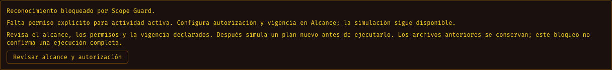
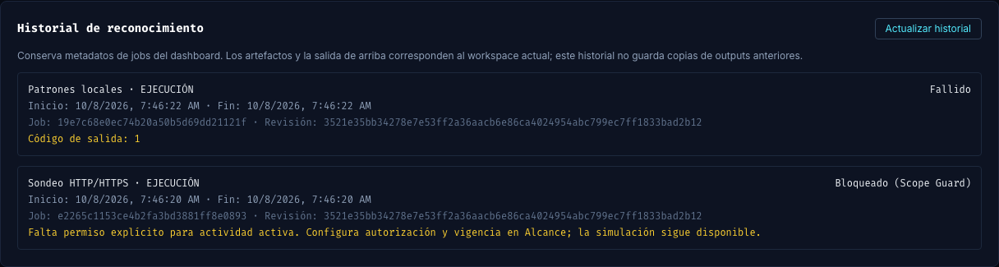

# Fase 153: motivo de bloqueo separado del fallo técnico

Fecha: 2026-10-08. Rama: `phase/153-recon-blocked-reasons`. Base inicial: `c481335` (fase 152); integrada `d186963` tras merge aprobado de #172. PR #173 listo para revisión individual. Worktree aislado: `/Users/castr/tmp/t01-recon-blocked`. Entrega parcial V3-02b.

## Problema comprobado

Un sondeo detenido por falta de permiso activo quedaba como `failed`, con solo «Código de salida: 1» en el job y el historial. La consola tenía la explicación, pero la vista persistente no distinguía una decisión de Scope Guard de una herramienta averiada.

## Cambios

- Una excepción `ScopeError` durante una etapa agrega `failure_kind: scope_guard` y el motivo al resultado/resumen. `StageError`/`OSError` se clasifican como `technical`. El status JSON del pipeline conserva `failed` y la salida CLI sigue siendo no cero: compatibilidad con consumidores actuales.
- El worker del dashboard conserva `blocked` y su motivo solo ante salida no cero, summary fallido del mismo run_id y clasificación explícita de Scope Guard con motivo válido. Summary ausente, antiguo, no correlacionado, enlazado, inválido o demasiado grande no cambia el fallo a bloqueo. No se clasifica buscando palabras en stdout.
- La cancelación conserva precedencia. La razón se limita a 2000 caracteres; el estado y motivo quedan en el job actual y en el historial existente, sin migración nueva de tablas.
- UI muestra «bloqueado», el motivo y una acción para revisar alcance/autorización. Abrir revisión recarga la configuración sin guardar permisos ni ejecutar. Explica que debe simularse un plan nuevo y que archivos anteriores no prueban finalización.
- El historial conserva etiquetas separadas para bloqueado y fallido; el evento de etapa explica cuándo detuvo Scope Guard.

## Validación

- **169 Python**: falta de permisos sigue bloqueando antes de herramientas/DNS, ahora con clasificación/motivo; fallo técnico tiene clase distinta. Contrato CLI existente conservado.
- **146 backend** en imagen aislada: fallo correlacionado de Scope Guard conserva bloqueo tras reapertura; errores técnicos, summary de otro run, salida cero, estado inconsistente y razón inválida no se convierten en bloqueo. Suites existentes de cancelación/recuperación siguen pasando.
- **97 frontend**, audit **0 vulnerabilidades** y Vite aprobado. DOM verifica motivo, historial y acceso a revisión sin guardar ni ejecutar.
- Chrome contra frontend/backend/pipeline instalados como tester: sondeo sin autorización se detiene antes de DNS y muestra bloqueo; revisar abre scope sin habilitar permiso ni lanzar otro job. Clasificación local sin input produce fallo técnico. Recarga conserva ambos registros.
- Build aislado `seclab-sbf:full-phase153`, hash `1c2596c2bcd74344`; smoke, Compose `.env.example`, Actionlint y gate CVE bajo política vigente aprobados. No se añadieron excepciones.

## Límites y reversión

Clasificación para errores de Scope Guard atrapados dentro de una etapa. Si falla la carga inicial del scope, la preparación de directorios o la lectura de checkpoint antes de las etapas, el proceso aún puede finalizar como fallo técnico sin summary correlacionado. Simulación no escribe summary nuevo; no se infiere bloqueo a partir de uno anterior. Registros históricos previos conservan su estado original.

No completa los eventos/estados de todo el engagement, preview de targets ni referencias finding→job. Tampoco afirma que no hubo tráfico anterior: un cambio de alcance durante una etapa puede detener nuevas acciones después de otras ya ejecutadas. Terminal libre sigue fuera de la interceptación.

Reversión: revertir el PR. No requiere eliminar historial ni cambiar datos existentes. El laboratorio vivo, proyectos del owner y su etiqueta de imagen permanecen intactos. La dependencia #172 está mergeada. #173 requiere su propia aprobación individual. CI del primer head aprobado en run `37787370099`; la sincronización con baseline no altera insumos ejecutables.
