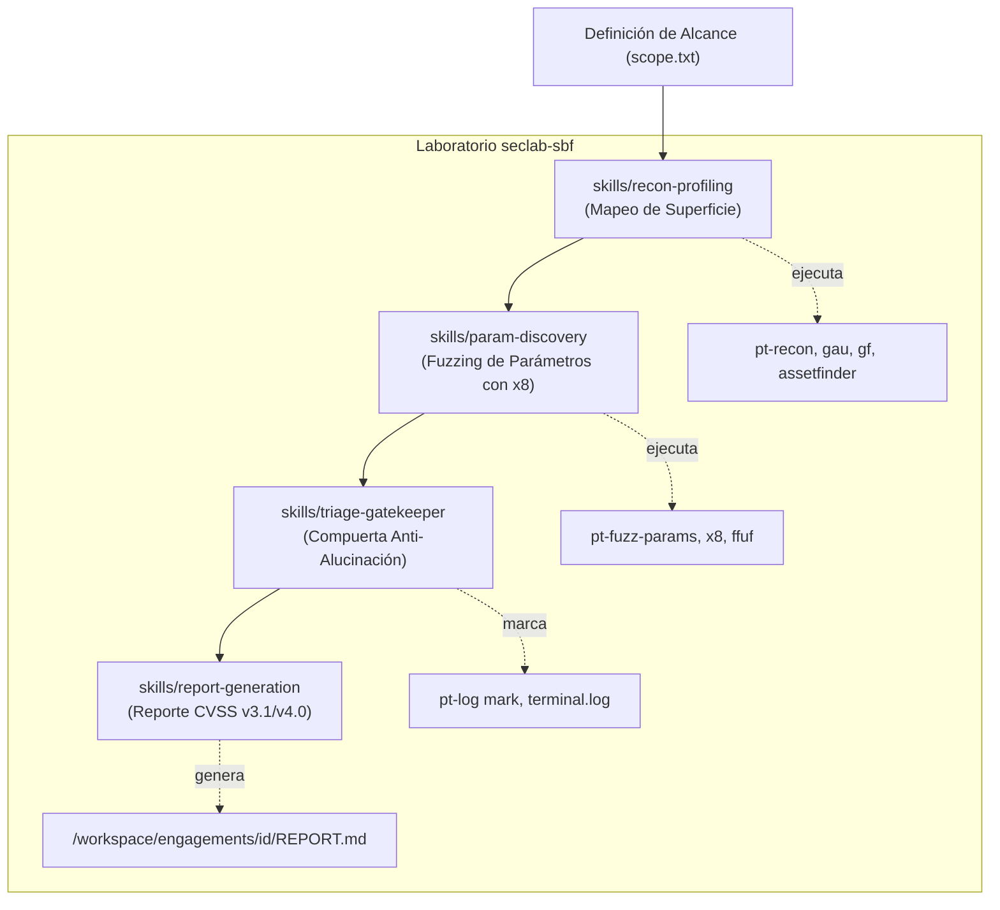

# Fase 65: Framework de Agent Security Skills & Workflows Metodológicos

## 1. Contexto y Objetivos

Con la incorporación de herramientas avanzadas de reconocimiento, fuzzing (`x8`, `gau`, `gf`, `qsreplace`, `findomain`, `assetfinder`, `httprobe`, `pt-fuzz-params`) y sistemas de auditoría continua (`pt-log`, `pt-cheat`), el laboratorio `seclab-sbf` cuenta con un arsenal completo para auditorías éticas, bug bounty y formación práctica.

Sin embargo, para que un modelo de lenguaje o agente inteligente (e.g. Antigravity, Claude Code, subagentes locales o scripts de automatización) opere de forma disciplinada, es indispensable dotarlo de **capacidades estructuradas (Agent Skills)** y **metodología de triaje** que impidan:
1. Salirse del alcance autorizado (`scope.txt` / reglas de engagement).
2. Alucinar vulnerabilidades basadas en cabeceras triviales o respuestas de error de WAFs.
3. Ejecutar ataques ruidosos o fuera de política.
4. Generar reportes desordenados sin evidencia reproducible.

Inspirado en:
- **[mdpsec/bug-bounty-hunting-prompts](https://github.com/mdpsec/bug-bounty-hunting-prompts)**: Metodología *"Evidence-First"* de 10 fases con compuertas de triaje rigurosas (triage gates), validación empírica y plantillas profesionales para HackerOne y Bugcrowd.
- **[EvanThomasLuke/Awesome-AI-Security-Skills](https://github.com/EvanThomasLuke/Awesome-AI-Security-Skills)**: Estándar abierto de **Agent Skills** (`SKILL.md` con frontmatter YAML, metadatos, precondiciones y flujos reproducibles paso a paso).

Esta fase establece el framework oficial de Agent Skills en `seclab-sbf`, integrando directamente las herramientas del laboratorio y el sistema de logging `pt-log`.

---

## 2. Arquitectura de Agent Skills en `seclab-sbf`

### 2.1 Especificación del Formato `SKILL.md`

Cada habilidad reside en su propio directorio dentro de `skills/<skill-name>/SKILL.md` (y sincronizada en `workspace-seed/skills/<skill-name>/SKILL.md` para uso dentro del contenedor). Cumple la especificación abierta de Agent Skills:

```yaml
---
name: nombre-de-la-skill
description: Resumen conciso de cuándo y cómo el agente debe activar esta habilidad.
version: 1.0.0
author: hackadvisermx/seclab-sbf
license: MIT
tools_required:
  - run_command
  - view_file
category: recon | fuzzing | triage | reporting
---
```

Acompañada de:
1. **Precondiciones y Alcance**: Verificación obligatoria de `scope.txt` o `engagement.yaml`.
2. **Flujo de Ejecución Paso a Paso**: Comandos exactos del laboratorio (`pt-recon`, `x8`, `gau`, `gf`, `ffuf`, etc.).
3. **Manejo de Errores y Falsos Positivos**: Reglas explícitas para descartar anomalías cosméticas.
4. **Formato de Salida y Registro**: Integración con marcas de auditoría (`pt-log mark`) y almacenamiento de artefactos en `/workspace/engagements/<eng>/`.

---

## 3. Catálogo Inicial de Skills



### 3.1 `skills/recon-profiling` (Reconocimiento y Perfilado de Objetivos)
- **Objetivo**: Mapear activos y rutas web de forma pasiva y activa controlada sin violar el alcance.
- **Herramientas**: `assetfinder`, `findomain`, `httprobe`, `gau`, `gf` (`gf xss`, `gf ssrf`, `gf idor`, `gf sqli`, `gf redirect`), `qsreplace`.
- **Salida**: `/workspace/engagements/<eng>/recon/surface.json` y listas limpias de URLs con parámetros.

### 3.2 `skills/param-discovery` (Descubrimiento y Fuzzing de Parámetros)
- **Objetivo**: Descubrir parámetros ocultos, endpoints API y variables no documentadas mediante heurísticas de Rust (`x8`).
- **Herramientas**: `x8`, `pt-fuzz-params`, `ffuf`.
- **Salida**: `/workspace/engagements/<eng>/fuzzing/params_<target>.json` con parámetros identificados, diferencias de longitud de respuesta y códigos de estado.

### 3.3 `skills/triage-gatekeeper` (Compuerta de Triaje y Validación de Evidencias)
- **Objetivo**: Filtrar falsos positivos, respuestas genéricas de WAF y anomalías sin impacto de negocio ("Evidence-First").
- **Flujo**:
  - ¿El comportamiento es reproducible de forma consistente?
  - ¿Existe impacto en la confidencialidad, integridad o disponibilidad del activo?
  - Si es válido: ejecutar `pt-log mark "VULN-<ID>: <descripción>"` y volcar petición/respuesta a `evidence/<vuln-id>.md`.

### 3.4 `skills/report-generation` (Generación de Reportes Estructurados)
- **Objetivo**: Redactar informes técnicos y ejecutivos con métricas estándar de severidad (CVSS v3.1 / v4.0), pasos de reproducción y mitigación.
- **Salida**: `/workspace/engagements/<eng>/REPORT.md` (compatible con estándares de HackerOne, Bugcrowd y auditorías corporativas).

---

## 4. Estabilidad y Reconstrucción de la Imagen Docker

Como parte del soporte para estas herramientas:
- Se corrigió la compilación en caliente de `gf` (`test -f go.mod || go mod init github.com/tomnomnom/gf`).
- Se declararon explícitamente los argumentos `ARG ASSETFINDER_COMMIT` y `ARG HTTPROBE_COMMIT` en la etapa `upstream-builder` de `images/full/Dockerfile`.
- Se validó el build nativo (`make smoke-test` con 98 herramientas operativas).
