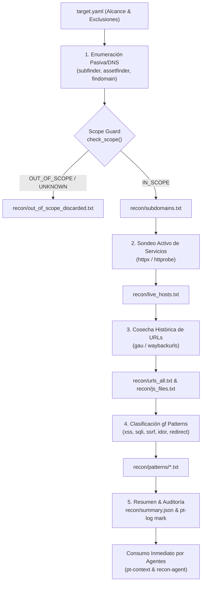

# Fase 73: Pipeline Automatizado de Reconocimiento con Scope Guard (`pt-recon-pipeline`, `pt-recon`)

## 1. Contexto y Objetivos

Con las herramientas upstream de reconocimiento integradas (`subfinder`, `assetfinder`, `findomain`, `httpx`, `httprobe`, `gau`, `waybackurls`, `gf`), la especificación de alcance (`target.yaml` / `pt-scope`) y la estructura de directorios del engagement (`/workspace/engagements/<id>/recon/`), esta fase implementa el **pipeline unificado, seguro y determinista de reconocimiento**:

1. **Motor Orquestador Determinista (`scripts/pt-recon-pipeline.py`)**:
   - Binario en Python stdlib instalado como `/usr/local/bin/pt-recon-pipeline` con permisos `0555` en [`images/full/Dockerfile`](file:///Users/castr/tmp/t01/images/full/Dockerfile#L742).
   - **Scope Guard Filtering Integrado**:
     - Antes de enviar cualquier sondeo de red activo, cada subdominio y URL descubierta es evaluada contra las reglas de `target.yaml` (`in_scope` vs `out_of_scope`).
     - Los objetivos que coinciden con exclusiones o quedan fuera del alcance son descartados y documentados en `recon/out_of_scope_discarded.txt` con timestamp y justificación.
   - **Pipeline en 5 Etapas Modulares**:
     1. `subdomains`: Enumeración pasiva/DNS (`subfinder`, `assetfinder`, `findomain`), filtrado de scope y consolidación en `recon/subdomains.txt`.
     2. `probe`: Sondeo activo de servicios HTTP/HTTPS en hosts autorizados (`httpx` / `httprobe`) hacia `recon/live_hosts.txt`.
     3. `urls`: Cosecha de URLs históricas (`gau`, `waybackurls`) hacia `recon/urls_all.txt`, y extracción de rutas JavaScript hacia `recon/js_files.txt`.
     4. `patterns`: Clasificación heurística de parámetros vulnerables (`gf` con patrones `xss`, `sqli`, `ssrf`, `redirect`, `idor`, `rce`, `lfi`) hacia `recon/patterns/<patrón>.txt`.
     5. `summary`: Emisión del resumen estructurado en `recon/summary.json` y registro automático de hitos forenses en `terminal.log` (`pt-log mark`).
   - Soporte para ejecución completa (`--stage all`) o granular (`--stage <etapa>`), modo de simulación (`--dry-run`) y salida estructurada (`-j, --json`).

2. **Integración en Shell Zsh (`shell/pentest-lab/pentest-lab.plugin.zsh`)**:
   - Refactorización de `pt-recon` para operar sin alterar el directorio de trabajo del operador (previniendo mutaciones inesperadas de `cd`).
   - Resolución automática del engagement activo o directorio objetivo.
   - Subcomandos de conveniencia:
     - `pt-recon [engagement|dominio] [--stage <etapa>] [--dry-run]`
     - `pt-recon status [engagement]`
     - `pt-recon filter <archivo_hosts> <target.yaml> [-o salida]`
   - Aliases ergonómicos añadidos:
     - `alias ptrecon="pt-recon"`
     - `alias reconpipeline="pt-recon"`
     - `alias recon="pt-recon"`
   - Documentación actualizada en `pt-help`.

---

## 2. Flujo del Pipeline de Reconocimiento



---

## 3. Estructura de Salida en el Engagement

Al ejecutar el pipeline en `/workspace/engagements/<id>/`, se produce la siguiente jerarquía estructurada:

```text
/workspace/engagements/<id>/
├── target.yaml                   # Definición formal de alcance
├── terminal.log                  # Registro con hito de auditoría RECON
└── recon/
    ├── subdomains.txt            # Subdominios únicos validados dentro de alcance
    ├── out_of_scope_discarded.txt# Objetivos excluidos con motivo
    ├── live_hosts.txt            # Servicios web activos confirmados
    ├── urls_all.txt              # Colección de URLs en alcance
    ├── js_files.txt              # Endpoints y scripts JavaScript identificados
    ├── patterns/                 # Clasificación por patrón de riesgo
    │   ├── idor.txt
    │   ├── redirect.txt
    │   ├── sqli.txt
    │   ├── ssrf.txt
    │   └── xss.txt
    └── summary.json              # Métricas y conteos en formato JSON
```

---

## 4. Ejemplos de Uso

### Ejecutar Reconocimiento Completo sobre un Engagement
```bash
# Ejecutar sobre el engagement activo (o especificado por nombre)
pt-recon acme-corp

# O mediante alias
ptrecon acme-corp
```

### Ejecutar Simulación (Dry-Run)
```bash
pt-recon acme-corp --dry-run
```

### Ejecutar Etapa Específica
```bash
# Solo enumerar subdominios y validar alcance
pt-recon acme-corp --stage subdomains

# Solo clasificar patrones con gf sobre URLs existentes
pt-recon acme-corp --stage patterns
```

### Inspeccionar Estado y Métricas
```bash
pt-recon status acme-corp
```

### Filtrar una Lista Externa contra el Scope de una Auditoría
```bash
pt-recon filter external_subs.txt /workspace/engagements/acme-corp/target.yaml -o authorized_subs.txt
```

---

## 5. Verificaciones y Suite de Calidad

1. **Pruebas Unitarias (`scripts/verify/check-python-units.py`)**:
   - `test_recon_pipeline_with_scope_guard`: Valida la normalización de objetivos, la evaluación estricta de alcance (positivos, exclusiones directas, comodines y objetivos desconocidos), la ejecución dry-run del pipeline generando `recon/summary.json`, el descarte a `out_of_scope_discarded.txt` y la presencia de helpers/aliases en Dockerfile y plugin Zsh.
   - `test_pentest_lab_plugin_helpers_and_aliases`: Valida helpers (`_pt-recon-script()`, `_pt-recon-help()`) y aliases (`ptrecon`, `reconpipeline`, `recon`).
   - Total: **62/62 pruebas en verde**.

2. **Suite de Verificación (`make verify`)**:
   - Gitleaks (0 secretos en código).
   - Hadolint (Dockerfiles validados).
   - ShellCheck, Actionlint y verificación de sintaxis de Makefile.
   - Verificación de Compose (`make compose-config`).
