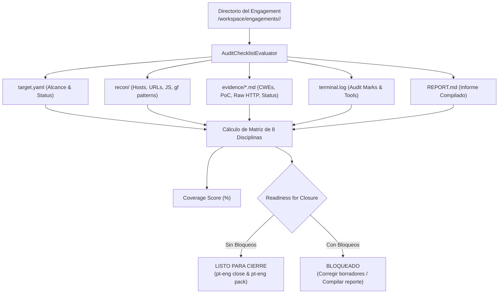

# Fase 74: Matriz de Cobertura y Checklist Metodológico de Auditoría (`pt-checklist`, `pt-eng check`)

## 1. Contexto y Objetivos

Con la creación (`pt-eng new`), el validador de alcance (`pt-scope`), el pipeline de reconocimiento (`pt-recon`), la gestión de hallazgos Evidence-First (`pt-finding`), la compilación técnica (`pt-report`) y el empaquetado/cierre (`pt-eng pack/close`), esta fase dota a `SECLAB-SBF` de un **mecanismo determinista de auditoría de calidad y evaluación de cobertura metodológica**:

1. **Motor Evaluador Determinista (`scripts/pt-audit-checklist.py`)**:
   - Binario en Python stdlib instalado como `/usr/local/bin/pt-audit-checklist` con permisos `0555` en [`images/full/Dockerfile`](file:///Users/castr/tmp/t01/images/full/Dockerfile#L743).
   - Sin dependencias externas (100% Python 3 stdlib).
   - **Evaluación Integral de Artefactos**:
     - `target.yaml` / `scope.txt`: Alcance formal, objetivos in-scope y exclusiones.
     - `recon/`: Subdominios, hosts activos, URLs, endpoints JavaScript y patrones `gf`.
     - `fuzzing/`: Parámetros descubiertos mediante `x8` o `pt-fuzz-params`.
     - `evidence/*.md`: Metadatos YAML, severidad CVSS, CWEs, pasos de reproducción (PoC) y evidencia HTTP cruda.
     - `terminal.log`: Trazabilidad forense y marcas de auditoría continua.
     - `REPORT.md`: Existencia y compilación del informe final de entrega.
   - **Mapeo a las 8 Disciplinas Metodológicas**:
     1. `recon`: Reconocimiento & Perfilado (`recon-profiling`).
     2. `fuzzing`: Descubrimiento Heurístico de Parámetros (`param-discovery`).
     3. `auth`: Control de Acceso & Matriz de Autorización (`auth-matrix-audit` / IDOR / BFLA / JWT).
     4. `logic`: Lógica de Negocio & Estados (`business-logic-audit` / TOCTOU / Carrera).
     5. `client`: Client-Side & SPAs (`client-side-spa-audit` / CORS / postMessage / JS bundles).
     6. `api`: Seguridad de APIs & Webhooks (`api-security-audit` / GraphQL / Mass Assignment).
     7. `injection`: Inyecciones de Servidor & SSRF (`ssrf-injection-audit` / Callbacks).
     8. `triage`: Triaje Evidence-First & Calidad (`triage-gatekeeper` / Reporte).
   - **Cálculo Ponderado de Cobertura (Coverage Score)**:
     - Disciplinas `COMPLETED` (1.0 pt), `IN_PROGRESS` (0.5 pts), `PENDING` (0.0 pts).
     - Puntuación porcentual: `(Puntos / 8) * 100%`.
   - **Compuerta de Preparación para el Cierre (`Readiness for Closure`)**:
     - Detecta bloqueos críticos antes de ejecutar `pt-eng close` (e.g. hallazgos en borrador sin verificar, ausencia de `REPORT.md`, scope no definido).

2. **Integración en Shell Zsh (`shell/pentest-lab/pentest-lab.plugin.zsh`)**:
   - Subcomando `pt-eng check [nombre] [opciones]`.
   - Comando directo `pt-checklist [nombre] [opciones]`.
   - Aliases ergonómicos añadidos:
     - `alias ptcheck="pt-checklist"`
     - `alias engcheck="pt-eng check"`
     - `alias coverage="pt-checklist"`
   - Modos de salida:
     - Visual en terminal con formato de tabla ASCII y colores ANSI.
     - Exportación en Markdown (`-m, --markdown`) para incluir en informes o bitácoras.
     - Estructurado JSON (`-j, --json`) para consumo de agentes (`pt-context`, `report-agent`).
     - Modo estricto (`--strict`) con exit code 1 si hay bloqueos o cobertura < 50%.

---

## 2. Flujo de Evaluación Metodológica



---

## 3. Ejemplo de Salida en Terminal

```text
SECLAB-SBF Checklist Metodológico & Cobertura de Auditoría
Engagement: acme-corp (ACTIVE)
Directorio: /workspace/engagements/acme-corp
Cobertura Metodológica: 75.0% (5/8 disciplinas completadas)
Total Hallazgos: 3 (3 verificados, 0 borradores)

#   Disciplina Metodológica          Estado                 Hallazgos   Detalles
-----------------------------------------------------------------------------------------------
1   Reconocimiento & Perfilado       [✓] COMPLETO           -           12 subdominios, 4 hosts vivos, 142 URLs
2   Descubrimiento de Parámetros     [✓] COMPLETO           -           Fuzzing ejecutado (5 patrones clasificados)
3   Control de Acceso & Auth Matrix  [✓] COMPLETO           1           1 hallazgo(s) de control de acceso/IDOR
4   Lógica de Negocio & Estados      [✓] COMPLETO           1           1 hallazgo(s) de lógica de negocio
5   Client-Side & SPAs               [~] EN CURSO           -           18 archivos JS archivados para auditoría
6   Seguridad de APIs & Webhooks     [ ] PENDIENTE          -           Sin pruebas de seguridad de API registradas
7   Inyecciones de Servidor & SSRF   [✓] COMPLETO           1           1 hallazgo(s) de inyección/SSRF
8   Triaje Evidence-First & Reporte  [✓] COMPLETO           -           Todos los 3 hallazgos confirmados y REPORT.md generado
-----------------------------------------------------------------------------------------------

Preparación de Cierre: LISTO PARA CIERRE (pt-eng close)
```

---

## 4. Ejemplos de Uso

### Evaluar Cobertura del Engagement Activo
```bash
pt-checklist
# o con alias
ptcheck
```

### Evaluar un Engagement Específico
```bash
pt-checklist client-acme
# o mediante pt-eng
pt-eng check client-acme
```

### Exportar la Matriz de Cobertura en Markdown
```bash
pt-checklist client-acme --markdown
```

### Ejecutar en Modo Estricto para Gates de CI / Pre-Cierre
```bash
pt-checklist client-acme --strict
```

---

## 5. Verificaciones y Calidad

1. **Pruebas Unitarias (`scripts/verify/check-python-units.py`)**:
   - `test_audit_checklist_and_coverage_evaluator`: Valida la introspección completa de engagement, el mapeo de CWEs y evidencia a disciplinas (`recon`, `auth`, `client`, etc.), la ponderación del score, los formateadores visual y markdown, y la integración en Dockerfile y plugin Zsh.
   - `test_pentest_lab_plugin_helpers_and_aliases`: Valida helpers (`_pt-checklist-script()`, `_pt-checklist-help()`, `pt-checklist()`) y aliases (`ptcheck`, `engcheck`, `coverage`).
   - Total: **63/63 pruebas en verde**.

2. **Suite de Verificación (`make verify`)**:
   - Gitleaks (0 secretos en código).
   - Hadolint (Dockerfiles validados).
   - ShellCheck, Actionlint y verificación estructural de Makefile.
   - Verificación de Compose (`make compose-config`).
