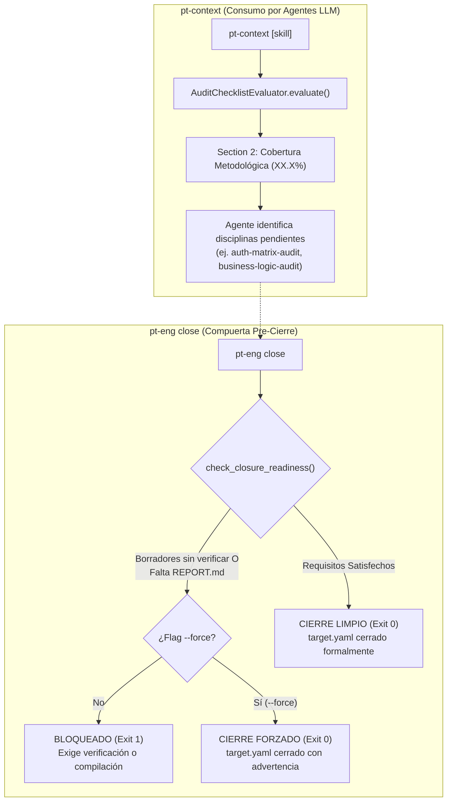

# Fase 75: Integración de Cobertura en `pt-context` y Compuerta Pre-Cierre en `pt-eng close`

## 1. Contexto y Objetivos

Con la matriz de cobertura metodológica y checklist implementados en la Fase 74 (`pt-checklist`, `pt-eng check`), esta fase une el bucle de retroalimentación entre los **agentes autónomos de seguridad** y el **ciclo de vida del engagement**, introduciendo dos capacidades fundamentales:

1. **Ingesta Automática de Cobertura en `pt-context` (`scripts/pt-agent-context.py`)**:
   - Ingesta determinista de la matriz de 8 disciplinas ofensivas y el Coverage Score generado por `AuditChecklistEvaluator` de `pt-audit-checklist`.
   - Incorporación de la **Sección 2** en la salida Markdown del contexto (`## 2. Cobertura Metodológica & Checklist (<Score>%)`), permitiendo a cualquier LLM o agente identificar de forma inmediata qué disciplinas están completadas, cuáles están en curso y cuáles permanecen pendientes.
   - Inclusión estructurada en la salida JSON (`--json`) bajo el campo `"coverage"`, exponiendo el score, las áreas completadas/en curso/totales, estado de readiness para cierre y bloqueos activos.
   - Renumeración armoniosa de las secciones posteriores en Markdown:
     - `## 1. Alcance y Reglas de Compromiso (Scope & Limits)`
     - `## 2. Cobertura Metodológica & Checklist (<Score>%)`
     - `## 3. Superficie de Ataque y Reconocimiento`
     - `## 4. Matriz de Hallazgos Validados (Evidence-First)`
     - `## 5. Trazabilidad de Auditoría`
     - `## 6. Directivas de Agente: <skill/prompt>` (si se especifica skill/prompt)

2. **Compuerta de Calidad Pre-Cierre en `pt-eng close` (`scripts/pt-engagement-packer.py`)**:
   - Función `check_closure_readiness` que evalúa de forma preventiva los requisitos antes de sellar la auditoría:
     - Existencia de especificación de alcance (`target.yaml` o `scope.txt`).
     - Ausencia de hallazgos en borrador sin verificar formalmente en `evidence/*.md` (`status: Borrador`, `unverified`, `draft`).
     - Existencia del informe compilado `REPORT.md` cuando existen hallazgos documentados.
   - Comportamiento de compuerta:
     - Si existen bloqueos y no se provee `--force`: aborta la operación con código de salida `1`, reporta detalladamente las causas en rojo/amarillo y sugiere las acciones correctivas (`pt-report build`, verificar hallazgos o forzar con `--force`).
     - Si se provee la bandera `-f, --force`: sella el engagement (`status: closed` y `closed_at` en `target.yaml`), advierte de los bloqueos omitidos y finaliza con éxito.
     - Si todos los requisitos se cumplen: sella el engagement limpiamente.

3. **Integración en Shell Zsh (`shell/pentest-lab/pentest-lab.plugin.zsh`)**:
   - Subcomando `pt-eng close [nombre] [opciones]` actualizado para aceptar opciones `-f, --force` y `-j, --json` de manera desacoplada de la ruta o nombre del engagement.
   - Documentación actualizada en `_pt-eng-help` y alias ergonómico `ptclose`.

---

## 2. Arquitectura del Flujo Integrado



---

## 3. Ejemplos de Uso

### Consultar Contexto con Cobertura para Agentes
```bash
# Contexto completo en Markdown
pt-context acme-corp

# Contexto con directiva metodológica
pt-context acme-corp auth

# Salida estructurada JSON
pt-context acme-corp --json
```

### Intento de Cierre con Bloqueo de Calidad
```bash
$ pt-eng close acme-corp

[!] Cierre bloqueado por compuerta de calidad para acme-corp:
    - ❌ Existen hallazgos sin verificar formalmente: VULN-DRAFT-01
    - ❌ El informe final REPORT.md no ha sido compilado (ejecute: pt-report build)

  Para corregir:
    - Verifica hallazgos en evidence/*.md (status: Confirmado)
    - Compila el reporte: pt-report build
    - O fuerza el cierre con: pt-eng close --force
```

### Cierre Forzado de Emergencia
```bash
$ pt-eng close acme-corp --force

[!] Advertencia: Engagement cerrado con --force (requisitos omitidos):
    - ⚠️ Existen hallazgos sin verificar formalmente: VULN-DRAFT-01

[+] Engagement cerrado satisfactoriamente:
    Engagement:        acme-corp
    Fecha de cierre:   2026-10-04T17:30:00+00:00
    target.yaml:       Actualizado a status: closed
```

### Cierre Limpio tras Cumplir Requisitos
```bash
# 1. Confirmar hallazgos y compilar informe
pt-finding check
pt-report build

# 2. Cerrar formalmente
pt-eng close acme-corp
```

---

## 4. Verificación y Calidad

- **Pruebas unitarias de seguridad (`scripts/verify/check-python-units.py`)**:
  - `test_agent_context_aggregator`: Valida que `generate_context_dict` incluya la clave `coverage` y que el Markdown formatee la Sección 2 con reordenamiento correlativo.
  - `test_context_coverage_and_closure_guard`: Valida el bloqueo determinista ante hallazgos en borrador, la omisión segura mediante `force=True`, el cierre limpio ante cumplimiento de requisitos y la exposición de opciones en el plugin Zsh.
  - 64 de 64 pruebas unitarias pasando al 100%.
- **Validaciones estáticas de calidad**:
  - `make verify` (Gitleaks, Hadolint, ShellCheck, Compose security, Python unit tests).
  - `actionlint` en `.github/workflows/security.yml`.
