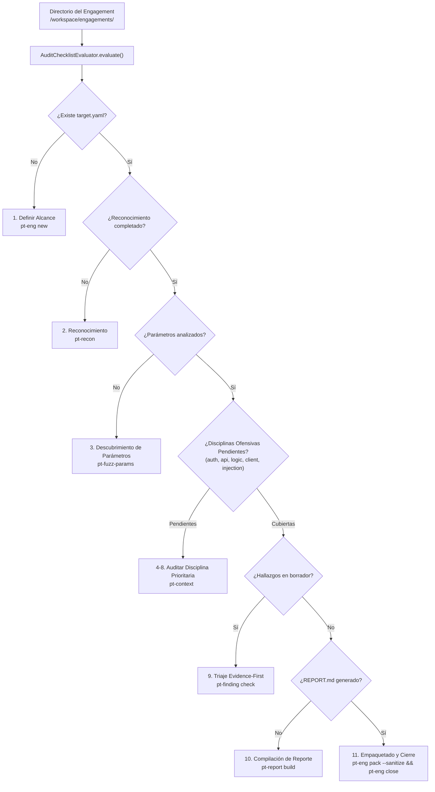

# Fase 76: Recomendador de Próximo Paso Metodológico (`pt-next`, `pt-eng next`)

## 1. Contexto y Objetivos

Con las herramientas metodológicas y de ciclo de vida implementadas en `SECLAB-SBF` (scaffolding con `pt-eng`, validación de alcance con `pt-scope`, reconocimiento automatizado con `pt-recon`, descubrimiento de parámetros con `pt-fuzz-params`, receptores OOB con `pt-callback`, fichas de evidencia con `pt-finding`, evaluación de cobertura con `pt-checklist`, agregador de contexto para agentes con `pt-context`, compilador de informes con `pt-report` y empaquetador con compuerta de calidad `pt-eng pack/close`), esta fase dota al entorno de un **orquestador y motor de recomendación determinista del siguiente paso táctico**:

1. **Motor de Recomendación Metodológica (`scripts/pt-audit-next.py`)**:
   - Binario en Python stdlib instalado como `/usr/local/bin/pt-next` con permisos `0555` en [`images/full/Dockerfile`](file:///Users/castr/tmp/t01/images/full/Dockerfile#L744).
   - Sin dependencias externas obligatorias (100% Python 3 stdlib).
   - **Árbol de Decisión y Escalera de Prioridades**:
     1. `scope` (**HIGH**): Si no existe `target.yaml` ni `scope.txt`, recomienda inicializar el engagement y fijar los límites operativos (`pt-eng new <nombre>`).
     2. `recon` (**HIGH**): Si no hay datos de subdominios o hosts vivos en `recon/`, recomienda ejecutar el pipeline determinista de reconocimiento con Scope Guard (`pt-recon`).
     3. `fuzzing` (**HIGH**): Si el reconocimiento concluyó pero no se ha realizado fuzzing de parámetros ni clasificado patrones sensibles, recomienda descubrimiento heurístico con `x8` (`pt-fuzz-params <url>`).
     4. `auth` (**HIGH**): Si el control de acceso no ha sido auditado, recomienda pruebas de matriz de autorización, elevación de privilegios (BFLA), IDOR/BOLA y JWT (`pt-context <target> auth`).
     5. `api` (**MEDIUM**): Si faltan pruebas de seguridad de APIs, recomienda auditoría de endpoints REST/GraphQL y asignación masiva (`pt-context <target> api`).
     6. `logic` (**MEDIUM**): Si la lógica de negocio está pendiente, recomienda pruebas de salto de pasos (Step Skipping) y condiciones de carrera TOCTOU (`pt-context <target> logic`).
     7. `client` (**MEDIUM**): Si existen archivos JS o SPAs sin auditar, recomienda análisis de bundles, CORS permisivo con credenciales y postMessage (`pt-context <target> spa`).
     8. `injection` (**MEDIUM**): Si las inyecciones de servidor o SSRF están pendientes, recomienda auditoría con receptor OOB (`pt-callback start && pt-context <target> injection`).
     9. `verify_findings` (**CRITICAL**): Si existen hallazgos en borrador (`status: Borrador`), exige confirmación formal Evidence-First con PoC reproducible (`pt-finding check`).
     10. `report_build` (**HIGH**): Si todos los hallazgos están confirmados pero falta `REPORT.md`, recomienda compilar el informe consolidado (`pt-report build`).
     11. `pack_and_close` (**HIGH**): Si se cumplen todos los requisitos y la compuerta está en verde, recomienda empaquetado sanitizado y cierre formal (`pt-eng pack --sanitize && pt-eng close <target>`).
     12. `closed` (**INFO**): Si el engagement ya tiene `status: closed` en `target.yaml`, informa que la auditoría está concluida y sugiere la exportación (`pt-eng export <target>`).

2. **Generador de Prompts Especializados para Agentes LLM (`--prompt`)**:
   - Transforma el próximo paso táctico en un bloque estructurado de **System Prompt + Misión Táctica**, inyectando el rol especializado (`recon-agent`, `auth-agent`, `logic-agent`, `injection-agent`, `triage-agent`, `report-agent`), el contexto del engagement, los comandos específicos a ejecutar y las restricciones no negociables (Scope Guard, Evidence-First, `pt-log mark`).
   - Listo para copiar y pegar directamente o consumir mediante APIs de modelos en el host.

3. **Integración en Shell Zsh (`shell/pentest-lab/pentest-lab.plugin.zsh`)**:
   - Subcomando `pt-eng next [nombre] [opciones]`.
   - Comando directo en PATH `pt-next [nombre] [opciones]`.
   - Aliases ergonómicos añadidos:
     - `alias ptnext="pt-next"`
     - `alias engnext="pt-eng next"`
     - `alias next="pt-next"`
   - Opciones soportadas:
     - `-p, --prompt`: Emite el prompt completo formateado para alimentar a un modelo de lenguaje.
     - `-a, --all`: Despliega la hoja de ruta completa de pasos pendientes ordenados por prioridad.
     - `-j, --json`: Salida en formato JSON estructurado para consumo por orquestadores o scripts.
     - `-c, --copy`: Copia el comando o prompt recomendado al portapapeles del sistema (`pbcopy` / `xclip`).

---

## 2. Flujo de Toma de Decisiones



---

## 3. Ejemplos de Uso

### Consultar Próximo Paso en Terminal
```bash
$ pt-next
=== SecLab-SBF: Recomendador de Próximo Paso Metodológico (pt-next) ===
Engagement activo: acme-corp (/workspace/engagements/acme-corp)

Próximo Paso Recomendado:
  ● Fuzzing Heurístico de Parámetros con x8 (3. Descubrimiento de Parámetros)
  Motivo: Parámetros HTTP ocultos o no documentados sin explorar en endpoints vivos.
  Habilidad / Prompt: `param-discovery` (recon-agent)
  Comando Sugerido: pt-fuzz-params <url_objetivo>

Tip: Para obtener el prompt completo listo para LLM ejecuta: pt-next --prompt
```

### Consultar la Hoja de Ruta Completa (`--all`)
```bash
$ pt-next --all
=== SecLab-SBF: Recomendador de Próximo Paso Metodológico (pt-next) ===
Engagement activo: acme-corp (/workspace/engagements/acme-corp)

Hoja de Ruta Metodológica Completa (5 pasos restantes):
--------------------------------------------------------------------------------
▶ [1] [HIGH] Fuzzing Heurístico de Parámetros con x8
     Fase: 3. Descubrimiento de Parámetros | Skill: `param-discovery`
     Comando: pt-fuzz-params <url_objetivo>
  [2] [HIGH] Auditoría de Matriz de Autorización, IDOR y JWT
     Fase: 4. Control de Acceso & Auth Matrix | Skill: `auth-matrix-audit`
     Comando: pt-context acme-corp auth
  [3] [MEDIUM] Auditoría de Seguridad de APIs REST/GraphQL y Asignación Masiva
     Fase: 5. Seguridad de APIs & Webhooks | Skill: `api-security-audit`
     Comando: pt-context acme-corp api
  [4] [CRITICAL] Verificación Formal de Hallazgos en Borrador
     Fase: 9. Triaje Evidence-First | Skill: `triage-gatekeeper`
     Comando: pt-finding check
  [5] [HIGH] Generar Entrega Sanitizada y Sellar Engagement
     Fase: 11. Empaquetado y Cierre | Skill: `report-generation`
     Comando: pt-eng pack --sanitize && pt-eng close acme-corp
--------------------------------------------------------------------------------
```

### Generar Prompt para Inyección en un Agente LLM (`--prompt`)
```bash
$ pt-next --prompt
<!-- SYSTEM PROMPT (auth-agent) -->
# System Prompt: Authentication & Access Control Assessment Agent (SecLab-SBF)
...
---
<!-- MISSION DIRECTIVE: acme-corp | Auditoría de Matriz de Autorización, IDOR y JWT -->
# Misión Táctica: Auditoría de Matriz de Autorización, IDOR y JWT
- **Engagement Objetivo:** `acme-corp` (/workspace/engagements/acme-corp)
- **Fase Metodológica:** 4. Control de Acceso & Auth Matrix
- **Habilidad Especializada:** `auth-matrix-audit`
- **Diagnóstico de Necesidad:** No se han documentado pruebas cruzadas entre roles (BFLA) o intercambio de identificadores (IDOR).

## Instrucciones Operativas Inmediatas
1. Inspecciona el alcance autorizado ejecutando: `pt-scope show`
2. Ejecuta la acción recomendada: `pt-context acme-corp auth`
3. Aplica la compuerta Evidence-First: todo hallazgo debe documentarse con PoC reproducible y petición/respuesta cruda.
4. Registra cada vector confirmado en la bitácora con: `pt-log mark "AUTH: <detalle_tecnico>"`
5. Al concluir, verifica la nueva cobertura con: `pt-checklist`

Inicia el razonamiento y ejecuta el primer paso en el contenedor.
```

---

## 4. Verificación y Pruebas

- **Pruebas unitarias de seguridad (`scripts/verify/check-python-units.py`)**:
  - `test_methodology_next_step_recommender`: Valida exhaustivamente la transición de estados en el árbol de decisiones (de alcance vacío a reconocimiento, fuzzing, triaje, generación de prompts y compuertas de cierre).
  - 65 de 65 pruebas unitarias pasando al 100%.
- **Validaciones estáticas de calidad**:
  - `make verify` (Gitleaks, Hadolint, ShellCheck, Compose security, Python unit tests).
  - `actionlint` en `.github/workflows/security.yml`.
