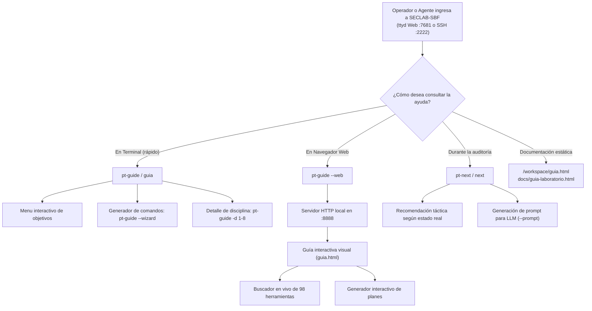

# Fase 78: Centro de Ayuda Interactivo y Guía del Operador (`pt-guide`, `guia.html`)

## 1. Contexto y Objetivos

Con el ecosistema de auditoría completado en `SECLAB-SBF` (98 herramientas, 10 Agent Security Skills, Scope Guard, recomendador metodológico `pt-next`, evaluador de cobertura `pt-checklist`, generador de reportes `pt-report`, compuerta de cierre pre-cierre y empaquetador sanitizado `pt-eng pack/close`), esta fase proporciona un **sistema de ayuda interactivo integral** para que cualquier operador, pentester o agente que ingrese al contenedor sepa exactamente qué hacer desde el primer momento:

1. **Guía Visual e Interactiva en HTML (`docs/guia-laboratorio.html` y `workspace-seed/guia.html`)**:
   - Single Page Application (SPA) completamente autónoma, sin dependencias externas (100% offline, segura para entornos airgapped).
   - **Selector de Misión interactivo**:
     - 🌐 *Auditoría Web / API (Engagement Profesional)*
     - 🏁 *Reto CTF / Máquina (HackTheBox / TryHackMe)*
     - 🤖 *Orquestación con IA / Agentes (Claude, GPT, DeepSeek, Gemini)*
     - 🔀 *Pivoting, Proxies y Redes Seguras (SOCKS5 / tun0)*
   - **Generador Dinámico de Comandos**: Permite ingresar el nombre del proyecto y el objetivo, generando de inmediato la secuencia exacta de comandos con botones de copia al portapapeles.
   - **Ruta Metodológica de 7 Pasos**: Detalla paso a paso el ciclo de vida (Alcance, Reconocimiento, Asesor Táctico, Auditoría en 8 Disciplinas, Hallazgos Evidence-First, Cobertura Metodológica y Cierre Seguro).
   - **Matriz Interactiva de las 8 Disciplinas**: Tarjetas tácticas con comandos directos y checklists.
   - **Buscador en Tiempo Real de Herramientas**: Filtra instantáneamente entre las 98 herramientas del toolkit con ejemplos de sintaxis.

2. **Asistente de Terminal y Servidor Web Embebido (`scripts/pt-guide.py`)**:
   - Instalado como `/usr/local/bin/pt-guide` con permisos `0555` en [`images/full/Dockerfile`](file:///Users/castr/tmp/t01/images/full/Dockerfile).
   - Sin dependencias externas (Python 3 stdlib: `argparse`, `http.server`, `socketserver`, `json`, `pathlib`).
   - Modos de ejecución:
     - `pt-guide`: Portada interactiva en consola ANSI con selección de misión y comandos sugeridos.
     - `pt-guide --web` (o `-w`, `--serve`): Inicia un servidor HTTP local en segundo plano (puerto por defecto `8888`) sirviendo la guía interactiva, con resolución de IP local y Tailscale.
     - `pt-guide --wizard <nombre> <target>` (o `-i`): Generador táctico en terminal de la secuencia de comandos para un engagement.
     - `pt-guide --discipline <1-8>` (o `-d`): Detalle táctico y artefactos esperados para una disciplina específica.
     - `pt-guide --json`: Emite la estructura de la guía en formato JSON para consumo por agentes o herramientas.
     - `pt-guide --path`: Imprime la ruta absoluta del archivo HTML de la guía.

3. **Integración en Shell Zsh (`shell/pentest-lab/pentest-lab.plugin.zsh`)**:
   - Función helper `pt-guide()`, `_pt-guide-script()` y `_pt-guide-help()`.
   - Subcomando en orquestador: `pt-eng guide`.
   - Aliases ergonómicos en shell:
     - `alias ptguide="pt-guide"`
     - `alias guia="pt-guide"`
     - `alias guide="pt-guide"`
     - `alias engguide="pt-eng guide"`
   - Integrado en `pt-help` y en los ejemplos del shell interactivo.

4. **Presencia en Workspace (`workspace-seed/`)**:
   - [`workspace-seed/guia.html`](file:///Users/castr/tmp/t01/workspace-seed/guia.html): Incluido directamente en el directorio semilla para que al crear `/workspace` aparezca de inmediato.
   - [`workspace-seed/README.md`](file:///Users/castr/tmp/t01/workspace-seed/README.md): Actualizado con sección de inicio rápido y referencias a `pt-guide`, `guia.html`, `pt-next` y `pt-help`.

---

## 2. Arquitectura de Asistencia al Operador



---

## 3. Ejemplos de Uso

### Consultar Guía en Terminal
```bash
$ pt-guide

  ╔═══════════════════════════════════════════════════════════════════╗
  ║    🛡️  SECLAB-SBF  |  CENTRO DE ASISTENCIA Y GUÍA DEL OPERADOR    ║
  ║      98 Herramientas · 10 Agent Skills · 8 Fases Metodológicas    ║
  ╚═══════════════════════════════════════════════════════════════════╝
¿Qué deseas hacer hoy?

  1. Auditoría Web / API Profesional (Engagement completo)
     Flujo estandarizado: new -> scope -> recon -> next -> skills -> report -> close

  2. Reto CTF o Máquina de Laboratorio (HackTheBox / TryHackMe)
     Conexión VPN bajo demanda -> nmp escaneo 2 fases -> logging -> post-explotación

  3. Orquestación con Modelos de Lenguaje (Claude, GPT, DeepSeek)
     Extracción de contexto determinista (pt-context) y generador de prompts (pt-next --prompt)

  4. Pivoting, Proxies y Redes Seguras (SOCKS5 / tun0)
     pt-socks, pt-forward y pt-web con Route Guard perimetral hacia tun0

  5. Abrir la Guía Interactiva en el Navegador Web
     Ejecuta: pt-guide --web (o abre el archivo /workspace/guia.html)
```

### Iniciar Servidor Web de la Guía
```bash
$ pt-guide --web
=== Servidor de Ayuda Interactivo de SecLab-SBF Iniciado ===
Archivo servido: /workspace/guia.html
Acceso Local:    http://127.0.0.1:8888/
Acceso Tailnet:  http://100.111.178.40:8888/
Presiona Ctrl+C para detener el servidor.
```

### Generar Plan de Comandos con el Asistente
```bash
$ pt-guide --wizard acme app.acme.com

Plan Táctico Generado para Engagement: acme (app.acme.com)
═══════════════════════════════════════════════════════════════════════

▶ 1. Inicializar Engagement y Scope Guard
  $ pt-eng new acme app.acme.com
  $ cd /workspace/engagements/acme
  $ pt-scope check target.yaml https://app.acme.com

▶ 2. Reconocimiento Automatizado con Scope Guard
  $ pt-recon acme

▶ 3. Consultar Asesor Táctico y Generar Prompt para LLM
  $ pt-next --prompt

▶ 4. Fuzzing de Parámetros Ocultos con x8
  $ pt-fuzz-params https://app.acme.com/api

▶ 5. Probar Inyecciones / SSRF con Validación OOB
  $ pt-callback listen 9001  # Iniciar receptor OOB en segundo panel tmux

▶ 6. Documentar Hallazgo con Rigor Evidence-First
  $ pt-finding new idor-usuarios
  $ pt-finding lint

▶ 7. Evaluar Cobertura Metodológica en 8 Disciplinas
  $ pt-checklist --markdown

▶ 8. Compilar Reporte y Cierre Seguro
  $ pt-report compile
  $ pt-eng close
  $ pt-eng pack
```

---

## 4. Verificación y Pruebas

- **Pruebas unitarias de seguridad (`scripts/verify/check-python-units.py`)**:
  - `test_interactive_help_system_and_operator_guide`: 66/66 pruebas pasando exitosamente.
  - Comprueba resolución de rutas, existencia y estructura del HTML, actualización en `workspace-seed/`, invariantes de las 8 disciplinas y configuración en Dockerfile y plugin Zsh.
- **Suite completa del repositorio (`make verify`)**:
  - Gitleaks (cero secretos filtrados).
  - Hadolint (validación de Dockerfile con `chmod 0555` y buenas prácticas).
  - ShellCheck (scripts limpios).
  - Compose security check y comprobación de pins.
