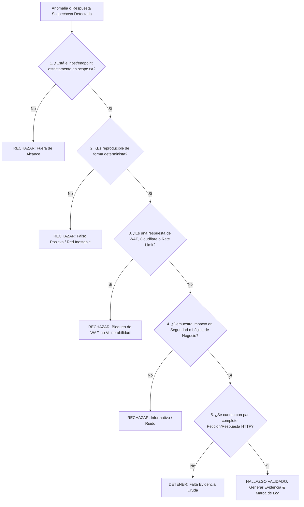

# Skill: Triage & Evidence Gatekeeper (`triage-gatekeeper`)

## 1. Propósito y Alcance

Inspirada en las fases de validación crítica y prevención de falsos positivos de **mdpsec/bug-bounty-hunting-prompts**, esta habilidad actúa como el árbitro de calidad del laboratorio. Impide que un agente de IA reporte como vulnerabilidad anomalías menores, cabeceras informativas o bloqueos genéricos de WAF.

---

## 2. Precondiciones y Guardrails (Compuerta en 5 Puntos)

Antes de clasificar cualquier comportamiento anómalo como vulnerabilidad, el agente DEBE someterlo a la siguiente compuerta lógica:



### Reglas Estrictas Anti-Alucinación:
1. **No a la especulación**: Nunca reportar "podría ser vulnerable a..." sin haber reproducido una prueba de concepto mínima y no destructiva.
2. **Cabeceras faltantes no son críticas**: La ausencia de cabeceras como `X-Frame-Options` o `Content-Security-Policy` por sí solas NO constituyen una vulnerabilidad crítica/alta a menos que exista un vector demostrable (e.g. clickjacking con impacto financiero/sesión).
3. **Errores 500 no son RCE ni SQLi**: Un error 500 por entrada malformada suele ser una excepción no controlada, no una inyección. Se requiere prueba de alteración de sintaxis o extracción de datos.

---

## 3. Flujo de Ejecución Paso a Paso

### Paso 1: Reproducción Mínima y Aislada con `curl`
Ejecutar la petición de prueba aislando cabeceras y parámetros:
```bash
ENGAGEMENT="<nombre_engagement>"
VULN_ID="VULN-<tipo>-<consecutivo>" # e.g. VULN-IDOR-01, VULN-SQLI-01
EVIDENCE_DIR="/workspace/engagements/${ENGAGEMENT}/evidence"
mkdir -p "${EVIDENCE_DIR}"

# Capturar petición y respuesta completas con cabeceras y cuerpo
curl -isk -X POST "https://target.example.com/api/v1/update" \
  -H "Authorization: Bearer <token_usuario_b>" \
  -H "Content-Type: application/json" \
  -d '{"account_id": "1001", "new_role": "admin"}' \
  > "${EVIDENCE_DIR}/${VULN_ID}_poc.txt"
```

### Paso 2: Evaluación de Impacto de Negocio
El agente debe responder por escrito:
- **Qué activo se ve afectado**: Base de datos, sesión de otro usuario, infraestructura subyacente.
- **Qué permisos requiere el atacante**: No autenticado, usuario básico, privilegios locales.
- **Severidad estimada (CVSS v3.1 / v4.0)**.

### Paso 3: Estampado de Marca en `pt-log`
Si el hallazgo supera los 5 puntos de la compuerta, sellar inmediatamente la bitácora:
```bash
pt-log mark "${VULN_ID}: Confirmado en /api/v1/update (Impacto: Elevación de privilegios horizontal IDOR)"
```

### Paso 4: Creación de Ficha Estructurada de Evidencia
Crear el archivo `${EVIDENCE_DIR}/${VULN_ID}.md` con el siguiente formato:

```markdown
# Evidencia: [VULN_ID] - [Título del Hallazgo]

- **Fecha:** YYYY-MM-DD HH:MM:SS UTC
- **Endpoint:** `[MÉTODO] https://target.example.com/ruta`
- **Severidad:** [Crítica | Alta | Media | Baja]
- **Categoría OWASP:** [e.g. A01:2021-Broken Access Control]

## 1. Descripción Técnica
[Explicación concisa de la causa raíz identificada]

## 2. Pasos Exactos de Reproducción (PoC)
1. Paso 1
2. Paso 2

## 3. Petición y Respuesta HTTP Crudas
\`\`\`http
[Petición HTTP]
\`\`\`

\`\`\`http
[Respuesta HTTP del Servidor]
\`\`\`

## 4. Impacto Real Comprobado
[Demostración empírica del impacto]

## 5. Referencia en Log de Auditoría
- Marca registrada en `terminal.log`: `[Timestamp de pt-log mark]`
```
